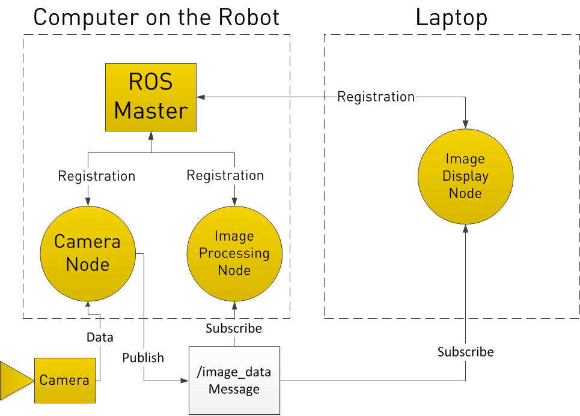

# Trinity ROS System

## ROS Basics
### Install
We're using ROS Kinetic with Ubuntu 16. Full install instructions are [here](http://wiki.ros.org/kinetic/Installation/Ubuntu), but here are the commands:
```ShellSession
sudo sh -c 'echo "deb http://packages.ros.org/ros/ubuntu $(lsb_release -sc) main" > /etc/apt/sources.list.d/ros-latest.list'
sudo apt-key adv --keyserver hkp://ha.pool.sks-keyservers.net:80 --recv-key 421C365BD9FF1F717815A3895523BAEEB01FA116
sudo apt-get update
sudo apt-get install ros-kinetic-desktop
echo "source /opt/ros/kinetic/setup.bash" >> ~/.bashrc
source ~/.bashrc
```
### Build System
#### Catkin Workspace
We're using [catkin tools](https://catkin-tools.readthedocs.io/en/latest/), **not** catkin\_make or rosinstall. A workspace is typically called `[name]_catkin_ws`. You need to create four folders inside called `build`, `devel`, `logs` and `src`. 
You initialize a workspace with 
```
catkin init
```
#### Catkin Packages
To create a package (packages should contain a bunch of related nodes), use
```
catkin create pkg PKG_NAME
```
You need to be inside the `src` folder of the workspace to create a package. Catkin will give you the files `CMakeLists.txt` and `package.xml`. CMakeLists has a lot of lines commented out with instructions and the commands already in the right order (so you shouldn't uncomment those :( ).
To make C++ and python code work in your package, you need to have these lines in CMakeLists uncommented:
```CMake
cmake_minimum_required(VERSION 2.8.3)
project(PKG_NAME)
find_package(catkin REQUIRED COMPONENTS roscpp rospy) # add more dependencies as needed ex. std_msgs
catkin_package()
include_directories(include ${catkin_INCLUDE_DIRS})
```
`package.xml` is for dependencies. Make sure you have the lines
```xml
<buildtool_depend>catkin</buildtool_depend>
<depend>roscpp</depend>
<depend>rospy</depend>
```
By convention, you have a `src` folder for C++ files, an `include` folder for header files, and a `scripts` folder for any scripts (python or shell).
To build a package, run
```
catkin build
```
from anywhere in the workspace. This will build all the packages. Only C++ files need to be built, not python. If something isn't working, you can try `catkin clean` to cleanup your workspace and then build again.
### How ROS Works
The two main languages used for ROS are C++ and Python. (Java and Javascript are also technically available). Most of our stuff is written in C++ but some stuff is easier to do with rospy.
ROS uses a pub/sub system with callbacks. This is a simple graph of how ROS works (not ours, I found it on google). 
<center></img></center>
Each ros node is registered with ROS master (run with `roscore` or run automatically through a launch file). Each node publishes data on topics that other nodes can subscribe to. For example, we have a motor encoders node that publishes on three topics, `/enc_1`, `/enc_2`, and `/enc_3`. The type of each of these topics is `int32`. CHECK IF CORRECT
#### Packages vs Nodes vs Workspaces
A **package** contains one or more **nodes**. Packages will usually contain a set of related nodes, usually all grouped into one or more launchfiles. When creating a package for general use, it is good practice to create a repo from the package and **not** the catkin workspace itself. This allows others to use their package in an existing workspace. While technically you can have more than one catkin workspace at a time, it isn't generally a good idea (mostly cause it causes lots of problems and breaks things).

#### Installing ROS packages from apt
Most of the packages released for ROS are on apt under the name `ros-kinetic-[package_name]`. Once the package is installed you can use all its nodes and launchfiles from ROS's commandline tools. If a package isn't available via apt, you can install it from source by cloning the package into the `src` folder of your repo and building. 

#### Writing a simple node (roscpp) 
A full tutorial for writing a simple pub/sub node in C++ is [here](http://wiki.ros.org/ROS/Tutorials/WritingPublisherSubscriber%28c%2B%2B%29). Some important stuff:

_includes_
```cpp
#include "ros/ros.h" // Always include this
#include "std_msgs/String.h" // Need this each time you want to use a message type (namespace/msg.h)
```
_mandatory lines_
```cpp
ros::init(argc, argv, "talker"); // You always need ros init, and your node name should be unique
ros::NodeHandle n; // You need a node handle
```
_creating a publisher_
```cpp
ros::Publisher chatter_pub = n.advertise<std_msgs::String>("chatter", 1000); // Create a publisher on the topic /chatter with a type of String and a queue size of 1000
```
_creating a subscriber_
```cpp
ros::Subscriber sub = n.subscribe("chatter", 1000, chatterCallback); // Subscribe to a topic /chatter with a queue size of 1000 and a callback called chatterCallback

// somewhere else in the code
void chatterCallback(const std_msgs::String::ConstPtr& msg)
{
  ROS_INFO("I heard: [%s]", msg->data.c_str()); // You usually put the data you got in a global variable to keep track of. Ew, I know.
}
```
#### Writing a simple node (rospy) 
By convention all python code is an a directory called `scripts`.
A full tutorial for writing a simple pub/sub node in python is [here](http://wiki.ros.org/ROS/Tutorials/WritingServiceClient%28python%29). Some important stuff:

_imports_
```python
import rospy
from std_msgs.msg import String
```
_mandatory lines_
```python
if __name__ == '__main__': # make a main function

# in either main or another function, but before everything else 
rospy.init_node('talker') # Init your node,
# No need for a nodehandle in rospy
```
_creating a publisher_
```python
pub = rospy.Publisher('chatter', String, queue_size=10) # topic /chatter with type String, queue size of 10
pub.publish("hi") # publish "hi"
```
_creating a subscriber_
```python
rospy.Subscriber("chatter", String, callback) # in rospy you have to provide the type to the callback

# later in your code
def callback(data):
    rospy.loginfo(rospy.get_caller_id() + "I heard %s", data.data)
```
#### Launch files
By convention, launch files are in a folder called `launch`. They are in xml and have the extension .launch. ROS's roslaunch page is [here](http://wiki.ros.org/roslaunch)
Launch files allow you to launch a bunch of (hopefully related) nodes at once. It also launches a ros master if there isn't already one running. Launch a file using:
`roslaunch [package name] [launchfile].launch`
The package name is optional if you're already in the `launch` folder as it looks there first.

Tags:

* `<?xml version="1.0" encoding="UTF-8"?>` at the top to mark the file as xml (optional)
* `<launch>`: wraps the entire launch file
* `<node>`: launches a single node
    *  _name_: a unique name for the node
    * - _pkg_: package the node is in
    *  _type_: what you named your node in ros init (roscpp) OR the name of the python file (rospy)
    * _args_: commandline args
    * _respawn_: run again if the node dies
* `<include>`: launch another roslaunch file
    * _file_: path to .launch file
* `<remap>`: remap a topic
    * _from_: original name of topic
    * _to_: new name of topic
* `<param>`: include a paramter / set a parameter on the parameter server
    * _name_: name of the paramter in the format of `namespace/name`
    * _value_: value of the parameter
    * _type_: parameter type (str, int, double, bool, yaml)
    * _textfile_: path to file if you're loading the params from a file
    * _command_: use `load` if you're loading paramters from a file
* `<group>`: group a set of commands under the same namespace
    * _ns_: the namespace
#### Parameter Server
ROS uses parameters to let you pass arguments (like topic names, tuning paramters etc) to ROS nodes and also to keep track of things like whether we are using simulated time. Paramter names need to be unique, but they also have namespaces. You can use these to launch more than one type of the same node (ex. three encoder nodes) and keep their paramter names separate. The names of the parameters a node takes in are configured in the code itself. You can set paramters in a launch file using the `<param>` tag or using `rosparam set [param name]`. Rosparam also has a `get` command and a `list` command.
**Be VERY CAREFUL with namespaces. If a ros node seems to be ignoring your parameters, it might not have the right namespace or name. You can print out what value it got from the node.**
There is a tutorial on rosparam [here](http://wiki.ros.org/ROS/Tutorials/UnderstandingServicesParams#Using_rosparam).
#### Command Line Tools and RQT
* `rostopic list|echo|pub [topic name]`: list the topics, echo a topic, or publish to a topic
    * [topic name] is only required for`echo` and `pub`
    * when using `rostopic pub`, double tab after you type the topic name for a message template
* `rosrun [package_name] [node_name]`: run a single node. roscore needed
* `roslaunch [package_name] [launch_file]`: launch a launchfile, roscore automatic
* `rosrun rqt_... rqt_...`: RQT has a ton of debugging tools for ros. There is a full list [here](http://wiki.ros.org/rqt_common_plugins) and you can also get them by double tabbing after rqt_. 
    * `rqt_plot` is very useful for graphing values in real time
    * `rqt_tf_tree` is useful for seeing what the transforms are like in real time
* `rosconsole`: Useful for debugging, you can view all messages being outputted by nodes and filter by nodes and severity level. Use the topic `/rosout` to see everything.
* [More here](http://wiki.ros.org/ROS/CommandLineTools) because I am lazy and I don't remember more useful ones off the top of my head

#### Services
Services are what what you use when you need an RPC reqeust/reply system. Instead of a topic with one publisher and many subscribers, a service has a set of two messages, one for the request and the reply. Services are usually used to make queries that need more information than one node has. (Ex. we use the InRoom service, which is a node that keeps track of where the robot is. If another node needs to know this information it can just ask the service instead of having to figure it out for itself each time) 

#### TF
TF nodes broadcast the transform from one frame of reference into another. If you have a sensor on the front of the robot, but need to make calculations based on the center of the robot, you are going to need to be able to transform the sensor data you get to sensor data you can use. If your sensor data is from a LIDAR, your transform would be from `laser` to `base_link`. 
<center></img></center>
In this example image (not our robot again), the transform between `laser_link` and `base_link` would consist of the x y z offset of the two coordinate frames, a well as the difference in rotation. ROS broadcasts this as a quaternion but there are functions to convert this to and from RPY (roll pitch yaw) as quaternions are not human readable ever.
For trinity, we use three of the standard frames above:

* `base_link`: This frame is rigidly attached to somewhere on the robot base. You can provide a z offset here if it makes sense for you to reference the robot position from above the ground (for trinity, everything is in 2D, so we don't worry about this). This frame can be in line with the odom frame, but doesn't have to be.
* `odom`: This frame is the one broadcasted by the odometry. In our case this is generated by the wheel encoder nodes. Since wheels are subject to drift, this frame is also subject to drift. This frame is usually given to the SLAM/localization node so it can generate a transform between `map` and `odom`, where the offset is the calculated drift of the robot.
* `map`: This is the frame broadcasted by the SLAM/localization node. It usually provides the transform between `map` and `odom`. If your SLAM is accurate, this is the best way to figure out where your robot is. 

TF can be very sensitive to time differences and likes to give "extrapolation into the past/future" errors. This is when it thinks that the time stamp on the transform is too far into the past for the transform to be considered useful. Sometimes, the time stamp on the transform can end up in the future due to the clocks of two computer systems not be entirely in sync. We ran into this wonderful problem at the last trinity competition, more info [here](https://defendtheplanet.net/2014/10/05/synchronize-time-ros-offline-environments-without-chrony/). This can also happen if you don't set up a simulation/rosbag properly (more info in the next section).
#### Rosbag
Rosbag is a commandline tool used to record and playback various topics. It's super useful if you need to record sensor data that you won't have access to for a while or if you need consistent data to debug code. The full command list is [here](http://wiki.ros.org/rosbag/Commandline), but some usful ones are: 

* `rosbag record [topic_name(s)]`: Records currently running specified topics into a bag file.
    * `-a` records all topics. Be careful because this includes the `/clock` topic (more below)
    * `-d x[m/h]` (duration) lets you record the bag for a specific amount of time (default secs) and then automatically exit
    * `--node=[node]` records all topics for a specific node
    * `-0 [output file]` specifies the output file name (extension .bag)
* `rosbag play [bag file(s)]`: Plays specified bag file(s)
    * `--clock` publishes the `/clock` topic. In order for this to work properly, set the `use_sim_time` parameter as well (`rosparam set use_sim_time true`)
    * `-l` loops the bag, be careful as this can mess with your tf because of the jump backwards in time.

#### Running on multiple machines
Running on multiple machines is important especially when you want to offload computing power from your robot. In a ROS system, one computer runs ROS master and all of the other computers with ROS installed can connect to it. It's best to give the computer running master a static IP so you don't have to constantly be changing it. All the computers obviously have to be running on the same network.

Each computer using ros accross multpile machines needs the following lines in `~/.bashrc` (assuming you are using bash).

* `export ROS_MASTER_URI=http://[MASTER_IP]:11311`
* `export ROS_HOSTNAME=[YOUR_IP]`

If you are trying to run ROS locally and you don't have your usual static IP (usually because you're not on our trinity network) make sure you comment out the lines because otherwise `roscore` won't work, as it will think that it is supposed to be running master on another machine.

## Trinity's ROS Setup
### How to Run
On master:

1. `roscore`
2. (a) `roslaunch trinity debug.launch` (if using joystick)
2. (b) `roslaunch trinity static_transforms.launch` (if using no joystick)
3. `roslaunch kiwi-drive robot_control.launch`
4. `roslaunch trinity navigation.launch`

On the pi:

1. `roslaunch trinity_pi robot_config.launch`

### Node Graph (generated using rqt_graph)
A graph of all our nodes and topics (excluding external):

<center> </img></center>
A graph of all our nodes and topics (including external): 

<center> </img>
_/play\_... is the pi, running off of a bag file._</center>

### List of topics and their Publishers/Subscribers
* /encX
    * Publishers: encoders
    * Subscribers: pid\_velocity, diff_tf
* /motorX_cmd
    * Publishers: pid_velocity
    * Subscribers: pwm_chip
* /wheelX_vtarget
    * Publishers: twist\_to\_motors
    * Subscribers: pid_velocity
* /wheelX_vel
    * Publishers: pid_velocity
    * Subscribers: none
* /scan
    * Publishers: rplidar_ros
    * Subscribers: hector_mapping, rviz
* /map
    * Publishers: gmapping
    * Subscribers: move_base, rviz
* /move\_base/global_costmap/costmap
    * Publsihers: move_base
    * Subscribers: control, rviz
* /odom
    * Publishers: diff_tf
    * Subscribers: robot\_pose\_ekf, rviz
* /move_base/goal
    * Publishers: control (through actionlib)
    * Subscribers: move_base, rviz
* /cmd_vel
    * Publishers: move_base
    * Subscribers: twist\_to\_motors
* /sound_start
    * Publishers: sound_start
    * Subscribers: control

### List of Launch Files

* robot_config.launch: Only launchfile run on the pi. Runs the
	- robot description (ros parameter)
	- joint state publisher
	- robot state publisher
	- encoders
		- encoder 1 topic (/enc1)
		- encoder 2 topic (/enc2)
		- encoder 3 topic (/enc3)
		- i2c_device (/dev/i2c-1)
		- slave_address (0x3)
		- pub_hz (20)
	- color sensor
		- i2c device (/dev/i2c-1)
	- pwm_chip
		- motor 1 topic (/motor1_cmd)
		- motor 2 topic (/motor2_cmd)
		- motor 3 topic (/motor3_cmd)
	- status light
	- solenoid
	- servo
	- gyro node
	- sound start
* robot_control.launch
	- twist to motors
		- motor 1 velocity target (/wheel1_vtarget)
		- motor 2 velocity target (/wheel2_vtarget)
		- motor 3 velocity target (/wheel3_vtarget)
	- pid_velocity (1)
	- pid_velocity (2)
	- pid_velocity (3)
		- encoder topic (/encX)
		- wheel velocity target (/wheelX_vtarget)
		- motor X topic (motor command) (/motorX_cmd)
		- wheel velocity (/wheelX_vel)
	- diff tf
		- encoder 1 topic (/enc1)
		- encoder 2 topic (/enc2)
		- encoder 3 topic (/enc3)
	- robot pose ekf (not currently tested)
* navigation.launch
	- hector mapping
	- rviz
		- includes custom config file
	- control
	- move base
* static_transforms.launch
	- map -> laser 
	- map -> laser_frame
	- map -> odom (published by gmapping)
	- map -> base\_link (NOT PUBLISHED, base\_link -> odom should be published by diff_tf)
	- map -> imu (published by IMU)

### Transforms
- map -> odom (navigation.launch)
- odom -> base_link (robot_control.launch)
- base_link -> laser (static_transforms.launch)
- base_link -> imu (currently: static_transforms, will be gyro node later)
- base_link -> wheels (robot_state_publisher)

### Installing new Packages on the Pi
It's a huge pain so I hope we don't have to do it anymore, leaving this out for now.

### Packages we are using
- rplidar_ros (edited slightly to work with gmapping, see the slack)
- kiwi-drive
- joint\_state_publisher
- robot\_state_publisher
- trinity_pi
- trinity
- gmapping

## Troubleshooting and Debugging
- `rosrun rqt_plot rqt_plot` for graphing values
- `rosrun rqt_tf_tree rqt_tf_tree` get the tf tree
- `rosconsole`: set log level and view all messages coming from nodes, filter etc (use the config button to set the topic to /rosout)
- `rostopic pub -r 10 /cmd_vel [double tab]`: publish a /cmd\_vel, defaults to 0 so you can hopefully stop the motors if it goes insane. You can also publish straight to `motorX_cmd` if it won't listen.
- `rosrun rviz rviz`: Our launchfiles start their own preconfigured rviz but you can use this to start a new one. You can add sensor listeners to subscribe to various topics and configure output, etc. 
- `rosbag`: As mentioned above, helpful for recording sensor data that can be used again and again, especially if you want to figure out if it's the code or sensors that are screwing up.
- `roswtf`: WTF is going on? Just prints out a ton of debugging information and it can find weird errors in your system. 
- `rosrun tf tf_echo [frame1] [frame2]`: View the transform from frame1 to frame2 in real time. 
- check your `use_sim_time` variable (`rosparam list`), it can cause problems
- restart everything, obviously

Theres lots more I can't think of right now bc I'm tired

## References

[tf and reference frames](http://library.isr.ist.utl.pt/docs/roswiki/hector_slam(2f)Tutorials(2f)SettingUpForYourRobot.html)

[standard frames](https://www.ros.org/reps/rep-0105.html)

[custom messages and services](http://wiki.ros.org/ROS/Tutorials/CreatingMsgAndSrv)

[timing issues](https://defendtheplanet.net/2014/10/05/synchronize-time-ros-offline-environments-without-chrony/) I THINK this is how we fixed it. I don't totally remember

[debugging tf](http://wiki.ros.org/tf/Debugging%20tools)

[network setup](http://wiki.ros.org/ROS/NetworkSetup)

